# 수학 문제 해결 구조 평가

파이프라인 전반을 검토한 뒤, 수학 문제를 잘 풀어낼 수 있는 구조인지 평가한 결과입니다.

---

## 1. 전체 흐름 요약

```mermaid
flowchart LR
    subgraph entry [진입]
        A[Interface.predict]
        B[solve_problem]
    end
    subgraph analysis [분석]
        C[Stage1 도메인/변수]
        D[rapid_intuition]
        E[classify_problem]
        F[assess_complexity]
    end
    subgraph routing [라우팅]
        G[should_decompose]
        H[CalculationRouter]
        I[StrategyBandit]
    end
    subgraph solve [해결]
        J[generate_code / candidates]
        K[Stage4 실행]
        L[Self-Correction]
        M[Stage5 검증]
    end
    subgraph out [출력]
        N[extract_final_answer]
        O[답 반환]
    end
    A --> B
    B --> C
    C --> D
    D --> E
    E --> F
    F --> G
    G --> H
    H --> I
    I --> J
    J --> K
    K --> L
    L --> M
    M --> N
    N --> O
```

- **진입**: Kaggle Gateway → `AIMOInterface.predict` → `orchestrator.solve_problem(domain, variables, problem_text)`.
- **분석**: Stage1 키워드 기반 도메인/변수 추출 → `rapid_intuition_phase` → `classify_problem`(complex/simple 등) → `assess_complexity`.
- **라우팅**: `should_decompose`(복잡도·타입) → `CalculationRouter`(N, 도메인별 전략 목록) → `StrategyBandit`으로 순서 조정.
- **해결**: 전략별로 `generate_code`(또는 voting 시 `generate_candidates`) → Stage4 실행 → 실패 시 Self-Correction → Stage5 검증.
- **출력**: `extract_final_answer_from_output` → 검증 통과 시 해당 답 반환.

### 1.1 다섯 축으로 보는 파이프라인

운영·문서에서 말하는 **큰 다섯 덩어리**는 아래처럼 묶을 수 있다. (⑥ 검증을 ⑤와 합쳐 **평가·검증** 한 축으로 둔다.)

| 축               | 내용            | 이 레포에서 대략                                                                              |
| --------------- | ------------- | -------------------------------------------------------------------------------------- |
| **1. 문제 입력**    | 텍스트·도메인·변수 유입 | `AIMOInterface.predict` → `orchestrator.solve_problem`                                 |
| **2. 문제 해석**    | 분류·복잡도·라우팅    | Stage1, `classify_problem`, `assess_complexity`, `CalculationRouter`, `StrategyBandit` |
| **3. 풀이 작성**    | 구조화 추론·전략 선택  | `reasoning_utils` 구조화 프롬프트, 하이브리드/분해 경로                                                |
| **4. 코드 작성·실행** | 코드 생성·실행·자기수정 | `generate_code`, Stage4, `attempt_code_fix` 등                                          |
| **5. 평가·검증**    | 정확도·형식·기호 검산  | Stage5, `AnswerExtractor`, 오프라인 `eval_*`, `ans_format_guard`(형식 게이트)                   |

위 표는 **개념 정렬**용이고, 실제 호출 순서는 위 절 mermaid(라우팅·폴백·Self-Correction)처럼 **한 줄로만 흐르지 않는다**.

### 1.2 그래서 이 구조는 “잘 돌아가나?”

| 질문                       | 판단                                                                                                                                                        |
| ------------------------ | --------------------------------------------------------------------------------------------------------------------------------------------------------- |
| **엔드투엔드로 연결돼 있나?**       | 예. `solve_problem` → 분석·라우팅 → 코드 생성·실행 → 검증·답 추출까지 **경로가 코드에 존재**하고, 문서 §2·§3에서도 그 강점·약점을 구체적으로 짚는다.                                                    |
| **항상 수학적으로 잘 풀리나?**      | **그건 별개**다. Stage1·복잡도가 휴리스틱이라 오분류가 나올 수 있고, 기하 전용 경로는 비활성 등 **설계상 한계**가 §3에 정리돼 있다.                                                                      |
| **배포(Vertex)·오프라인 평가는?** | 인프라·재현은 [WHY_THIS_VERTEX_STACK.md](./vertex/WHY_THIS_VERTEX_STACK.md) 동기에 맞고, **답 품질·`<ANS>` 준수**는 머지 모델·`eval_hf_local_quality` 등으로 **별도로** 확인하는 흐름이 맞다. |

**한 줄**: 구조는 **의도대로 돌아가게 짜여 있고**, “잘 푼다”는 **모델·데이터·평가 게이트**에서 따로 증명해야 한다.

**연구 실험 설계**(대조군·Vertex·지표·H0): [vertex/RESEARCH_EXPERIMENT_PROTOCOL.md](./vertex/RESEARCH_EXPERIMENT_PROTOCOL.md)

---

## 2. 잘 갖춰진 부분 (수학 풀이에 유리한 설계)

### 2.1 전략 다각화와 폴백

- **CalculationRouter** (`stage3_router.py`): N 크기·도메인에 따라 시뮬레이션(Path A), 이론(Path B), 하이브리드(Path C) 우선순위를 다르게 둠.
  - 작은 N: Simulator → Hybrid → Theoretician.
  - 큰 N(≥10^6): Theoretician → Hybrid → Simulator.
  - Geometry/Puzzle 등 도메인별 분기 존재.
- **StrategyBandit**: 로그 기반으로 전략 순서를 재조정해, 문제 유형별로 잘 맞는 전략을 앞에 두는 구조.
- 한 전략이 타임아웃/실패하면 다음 전략으로 넘어가는 **폴백 루프**가 명확함.

→ 수학 문제의 “크기·유형”에 따라 서로 다른 접근을 시도할 수 있어, 단일 전략보다 유리함.

### 2.2 구조화된 추론 (복잡 문제)

- **reasoning_utils.build_structured_prompt**: `<FACTS>`, `<GOAL>`, `<PLAN>`, `<DERIVATION>`, `<CHECK>`, `<ANS>` 템플릿으로 단계별 추론을 유도.
- 복잡도 점수(`assess_complexity`)와 길이 임계값(`STRUCTURED_LENGTH_THRESHOLD`)이 넘으면 **먼저 추론만 생성**하고, 그 다음 코드 생성에 활용 (`solver.generate_code`).
- `COMPLEXITY_STRUCTURED_MIN_SCORE`, `STRUCTURED_LENGTH_THRESHOLD` 등으로 “언제 구조화 프롬프트를 쓸지”가 설정 가능.

→ 단순 코드 생성이 아니라 “이해 → 계획 → 검산 → 답” 흐름을 갖춰, 수학 풀이에 맞는 설계임.

### 2.3 분해·하이브리드 경로

- **ProblemDecomposer**: 복잡도·타입이 임계치를 넘으면 `analyze_problem` → `decompose`로 서브문제 분해 → 의존성 순으로 풀고 결과를 다음 서브문제 컨텍스트로 넘김 (`solve_hierarchically`).
- **HybridReasoningEngine**: 그래프 기반 구조화 해결 (`solve_with_graph`)로 분해 경로와 연계됨.
- `should_decompose = (problem_type == 'complex' and complexity_score >= DECOMPOSITION_COMPLEXITY_THRESHOLD)` 로 “언제 분해할지”가 정책화되어 있음.

→ 한 번에 코드로 치기 어려운 복잡 문제를 단계적으로 나누어 풀 수 있는 구조임.

### 2.4 검증과 답 추출

- **Stage5 (VerificationRouter)**: SymPy 기반 파싱·비교 (simplify, factor, expand, trigsimp, 수치 허용오차, 리스트/다중집합 비교, 제약조건·역검증 등).
- **answer_extraction**: `<ANS>`, `\boxed{}`, LaTeX 분수, “answer is X” 등 여러 형식 지원; 유니코드 수학 기호 정규화.
- 실행 결과에서 최종 답만 뽑는 `extract_final_answer_from_output`로 검증 단계에 넘기는 값이 정제됨.

→ 수학적으로 동등한 답(다른 식, 약분 등)을 인정하고, 형식 오염을 줄일 수 있어 풀이 품질에 도움이 됨.

### 2.5 실행 실패 시 자기 수정

- 실행 결과에 `Error`가 포함되면 `attempt_code_fix` / `build_fix_code_prompt`로 수정 코드를 한 번 더 생성해 재실행.
- 실패 시 해당 전략을 포기하고 다음 전략으로 넘어가는 **Fallback Strategy** 로그가 명확함.

→ 문법/런타임 오류에 한해 자동 복구를 시도하는 구조라, 수학 풀이 안정성에 기여함.

### 2.6 선택적 다중 후보 투표

- `USE_VOTING` 시 `generate_candidates`로 여러 코드 생성 → 각각 실행·검증 후, **검증 통과한 답 중 다수결**로 선택.
- 검증 통과 후보가 없으면 “가장 많이 나온 답”으로 폴백.

→ 단일 샘플 대비 오답 변동을 줄이는 방향으로 설계되어 있음.

---

## 3. 약점 및 리스크 (개선 시 유리한 부분)

### 3.1 Stage1이 키워드/정규식에만 의존

- **ProblemAnalyzer**: 도메인 분류·변수 추출이 키워드 목록과 `re.findall(r'([A-Za-z])\s*=\s*(\d+)', ...)` 수준.
- 도메인이 잘못되면 CalculationRouter의 Geometry/Puzzle 분기가 잘못 타거나, 변수 N이 빠지면 N 기반 라우팅이 무력화될 수 있음.
- **개선 방향**: 중요 문제에 한해 LLM/작은 모델로 도메인·변수·난이도 재분류하거나, Stage1 결과를 “힌트”로 두고 라우터에서 불일치 시 재분류하는 단계를 두는 것을 고려할 수 있음.

### 3.2 복잡도·문제 타입 판단의 한계

- `assess_complexity`: 키워드 수, 절 개수, 기호 다양성, 길이 등 휴리스틱.
- `classify_problem`: 규칙/키워드 기반으로 computational/geometric/proof/complex 등 구분.
- “어렵지만 분해가 잘 안 되는 문제”나 “증명/찾기( find all )” 유형이 복잡도·타입에서 누락되면, 분해 경로나 전략 선택이 최적이 아닐 수 있음.
- **개선 방향**: 복잡도/타입에 LLM 1회 호출을 넣거나, 실패 로그를 피드백해 Bandit·임계치를 조정하는 방안을 검토할 수 있음.

### 3.3 기하 전용 경로 비활성화

- 주석으로 “Disable geometric handler for IMO-level evaluation (0.5B model insufficient)” 되어 있음.
- 기하는 일반 코드 생성(Simulator/Theoretician/Hybrid)에만 의존하며, SymPy Geometry 등 전용 경로는 사용되지 않음.
- **개선 방향**: 모델/리소스가 충분해지면 `_solve_geometric` 및 기하 전용 프롬프트를 다시 켜고, Stage1 기하 분류와 연동하면 기하 정확도에 도움이 됨.

### 3.4 Self-Correction이 1회 시도

- 실행 실패 시 수정 코드를 **한 번만** 생성해 재실행하고, 실패하면 바로 다음 전략으로 넘어감.
- 수학 문제는 “작은 버그 한두 개 수정”으로 통과할 수 있는 경우가 있어, 1회는 제한적일 수 있음.
- **개선 방향**: 설정 가능한 최대 수정 시도(예: 2회)나, RefineLoop와 연동해 “검증 실패 시에만 수정”하는 정책을 고려할 수 있음.

### 3.5 답 추출 엣지 케이스

- `extract_final_answer_from_output` 및 AnswerExtractor가 여러 패턴을 지원하지만, 자연어 설명 안에 있는 “답만” 뽑는 경우(예: “So the answer is 42.”)나 복잡 LaTeX/중첩 `\boxed` 등은 누락·오추출 가능성이 있음.
- **개선 방향**: 평가셋으로 실패 케이스를 수집해 패턴/정규식 보강하거나, “마지막 수/수식” 폴백 정책을 명시해 두는 것이 좋음.

### 3.6 Multi-Agent는 최후 폴백

- Multi-agent 경로는 다른 전략이 모두 실패한 뒤에만 호출되는 구조로 보임.
- 복잡 추론·토론이 유리한 문제는 처음부터 multi-agent를 시도하는 옵션이 있으면 유리할 수 있음.
- **개선 방향**: `problem_type == 'proof'` 또는 복잡도가 매우 높을 때 전략 목록 앞에 multi-agent를 넣는 분기를 두는 것을 검토할 수 있음.

---

## 4. 종합 판단

| 항목        | 평가   | 비고                                                     |
| --------- | ---- | ------------------------------------------------------ |
| 전략 다각화·폴백 | 잘 갖춤 | N·도메인별 Simulator/Theoretician/Hybrid, Bandit 재ordering |
| 구조화 추론    | 잘 갖춤 | FACTS/GOAL/PLAN/DERIVATION/CHECK/ANS, 복잡도 기반 사용        |
| 분해·하이브리드  | 잘 갖춤 | 복잡도 임계치 기반 분해, hierarchical·graph 연동                   |
| 검증·답 정규화  | 잘 갖춤 | SymPy, 다중 형식, 제약·역검증                                   |
| 자기 수정     | 적절   | 1회 수정 시도 후 전략 폴백                                       |
| 도메인/변수 분석 | 보통   | 키워드·정규식만 사용, 오분류 시 라우팅 영향                              |
| 복잡도·타입 판단 | 보통   | 휴리스틱, 증명·find all 등 특수 유형 보강 여지                        |
| 기하 전용     | 비활성  | 필요 시 재활성화 및 Stage1 연동 권장                               |
| 답 추출      | 보통   | 대부분 형식 커버, 엣지 케이스 보강 가능                                |

**결론**: 전체적으로 **수학 문제를 잘 풀어낼 수 있도록 설계된 구조**라고 볼 수 있다.

**향후 개선 (미구현)**: `classify_problem` / `assess_complexity`에 LLM 1회 호출 옵션을 두면 분류·복잡도 판단 정확도가 올라갈 수 있음. 실패 로그 피드백으로 Bandit·임계치 조정도 검토 대상. 전략 분기, 구조화 추론, 분해, 검증, 답 추출이 수학 풀이에 맞게 잡혀 있고, 약점은 주로 “분류·복잡도 판단의 정확도”와 “기하·증명 등 특수 경로/시도 횟수” 쪽이다.  
Stage1·복잡도·기하 경로·Self-Correction·multi-agent 진입 시점 등을 점진적으로 보강하면, 동일 아키텍처 위에서 수학 정확도를 더 끌어올리기 좋다.

---

## 5. 부록: Vertex 스모크 운영 도구

수학 파이프라인 본체와는 별도로, **Vertex 서울 스모크·리전 정리 스크립트**(`scripts/vertex/`, `vertex_common.py`)에 대한 내용은 아래 문서에 정리한다.

- **[VERTEX_SCRIPTS_EVALUATION.md](./VERTEX_SCRIPTS_EVALUATION.md)**  
  - 실행 점검 표 · 구조·모듈화 평가 표 · 리스크·개선 아이디어 · 종합 판단 · 공식 문서 교차 검증  
  - **§6 발견 문제 → 해결방안 → 코드 반영**(머신 타입 교정, 실패 시 cleanup·쿼터 힌트 등)  
  - **§7 답 품질**: [EVAL_REAL_MODEL.md](./vertex/EVAL_REAL_MODEL.md) — 로컬 `eval_hf_local_quality.py` / Vertex `eval_vertex_endpoint_quality.py`  
  - Deploy 오류(`n1-standard-1`)와 [configure-compute](https://cloud.google.com/vertex-ai/docs/predictions/configure-compute) CPU 표 교차 검증  
  - **스택 선택 이유**(Colab/HF 등 대비): [vertex/WHY_THIS_VERTEX_STACK.md](./vertex/WHY_THIS_VERTEX_STACK.md)

---

## 6. 부록: 검증·테스트 티어 (구조 vs 실추론 vs 정확도)

“구조가 돌아간다”와 “모델이 수학적으로 맞다”는 **다른 증거**가 필요하다. 이 레포에서 쓰는 층을 아래처럼 나눌 수 있다.

| 티어                  | 목적                                                   | 대표 수단                                                                                                                                                           | 비고                          |
| ------------------- | ---------------------------------------------------- | --------------------------------------------------------------------------------------------------------------------------------------------------------------- | --------------------------- |
| **0 — 실행기**         | 서브프로세스 실행·출력 수집                                      | `tests/test_real_inference_path.py` 의 `test_step0_*`, `CodeExecutor`                                                                                            | LLM 없음                      |
| **1 — 결정론적 Mock**   | `solve_problem` dict 계약, 라우팅 예외 없이 진행                | `AIMO_FAST_TEST=1`, `AIMO_MOCK_GENERATED_CODE` (기본 `print(0)`), `pytest -m structure`                                                                           | **문제를 풀지 않음**; 정확도 지표에 부적합  |
| **2 — 로컬 HF 스모크**   | `LocalLLMClient` → `Solver` → (가능하면) 실행까지 **실추론 경로** | `RUN_REAL_INFERENCE=1`, 소형 모델(예: `sshleifer/tiny-gpt2`), `OMI_QUANTIZATION=none`, `AIMO_LLM_DTYPE=float32`                                                      | 네트워크/캐시 필요; 출력 품질은 평가 대상 아님 |
| **3 — 오프라인 정확도·층화** | 난이도·유형·소스별 정확도, A/B                                  | `examples/run_numina_evaluation.py`, `EvaluationMetrics` (`by_difficulty`, `by_problem_type`, `by_question_type`), `examples/ab_eval_1000.py` + McNemar(전체·유형별) | 실제 모델·Vertex·엔드포인트          |

**모델 로드 횟수**: `run_numina_evaluation.py` / `ab_eval_1000.py` 는 기본 **`AIMO_EVAL_IN_PROCESS=1`** (미설정과 동일)이라 **프로세스당 orchestrator 하나**로 끝까지 돌리고, HuggingFace 가중치는 **한 번만** 올린다. 문제마다 자식 프로세스를 띄우며 매번 다시 로드하는 동작은 **`AIMO_EVAL_IN_PROCESS=0`** 일 때만 켜진다(로컬 대형 모델에는 비권장).

**양자화·모델 env 정렬**: `LocalLLMClient`는 `MATHCODEORCHESTRATOR_QUANTIZATION` → `**OMI_QUANTIZATION` / `AIMO_QUANTIZATION`** → 설정 기본값 순으로 읽는다. 소형 모델 스모크 시 `none` + `AIMO_LLM_DTYPE=float32` 조합이 안전하다.

**전역 HF 캐시**: 테스트 격리나 모델 전환 시 `src.pipeline.solver.reset_global_llm_cache()` 로 토크나이저·모델·파이프라인 전역 캐시를 비울 수 있다.

---

## 7. 부록: 15주차별 개발 변천사 (요약)

아래는 **저장소 커밋·문서·디렉터리 구조**를 바탕으로 한 **논리적 15주 타임라인**이다. 실제 일정과 1:1로 대응하지 않을 수 있으며, 초기에는 커밋이 구간별로 응축되어 있다.

| 주차 | 시기(대략) | 변천사 |
| --- | --- | --- |
| **1주** | 기점 | 저장소·브랜치·Cursor 워크트리 등 **개발 환경** 정비; 빈 커밋으로 워크트리 생성 허용 (`2025-12-18` 근거). |
| **2주** | — | **협업/브랜칭** 흐름에 맞춘 도구 설정(워크트리 지원 등, `2026-01-15`). |
| **3주** | — | `.gitignore`로 **캐시·모델 가중치** 등 대용량 산출물 제외, 재현 가능한 루트만 유지 (`2026-01-26`). |
| **4주** | — | **오프라인 평가 프레임워크** 도입: `src/evaluation`, 지표·설정 계약 정리; IMO/퍼즐류 문제 처리 경로 보강 (`2026-01-26`). |
| **5주** | — | 파이프라인과 평가를 잇는 **스크립트·예제**(`examples/`, `run_*evaluation.py`) 정착; “구조 테스트 vs 정확도” 구분의 초석. |
| **6주** | — | **5-Stage 파이프라인** 개념을 문서화(`docs/AIMO3/`): Stage1 라벨링, Stage3 Calculation Router(Simulator/Theoretician/Hybrid), Stage5 검증. |
| **7주** | — | **Orchestrator 중심**으로 `solve_problem` 계약 고정: 도메인·변수·복잡도 → 라우팅 → 코드 생성·실행 → 답 추출. |
| **8주** | — | **Numina / 로컬 HF** 경로: `LocalLLMClient`, 양자화·dtype·토큰 상한 등 실행 환경 변수 정렬; 평가 러너에서 **프로세스 내 단일 로드**(`AIMO_EVAL_IN_PROCESS`) 패턴. |
| **9주** | — | **StrategyBandit·폴백**: 전략 순서 재조정, 한 전략 실패 시 다음 전략; Self-Correction(코드 수정 1회)과 병행. |
| **10주** | — | **구조화 추론**(`reasoning_utils`): FACTS/GOAL/PLAN/DERIVATION/CHECK/ANS; 복잡도·길이 임계로 구조화 프롬프트 선택. |
| **11주** | — | **분해·하이브리드**: `should_decompose`, `ProblemDecomposer`, `HybridReasoningEngine`와 복잡도 임계 정책 연계. |
| **12주** | `2026-03-09` | **대시보드(XAI)** 와 **Qwen2.5-Math-1.5B** 등 모델 환경 정리; 결과 시각화·실험 추적 층 추가. |
| **13주** | `2026-03-17` | **대규모 파이프라인 패치**: Self-correction 시도·답 추출·멀티에이전트 조기 진입·기하 핸들러·Stage1 변수; `torch_dtype`→`dtype`, 생성 설정 정리; Kaggle OTLP는 플래그 시에만; **ZERO_ACCURACY_DEBUG** 등 데이터 형식·정답 판정 문서화. |
| **14주** | — | **검증 티어·품질 게이트** 명시: `ans_format_guard`, `eval_hf_local_quality`, McNemar A/B(`ab_eval_1000` 등); 문서·스크립트를 `docs/run-eval/`, `docs/vertex/`로 정리(`docs/CLEANUP_2026.md` 흐름). |
| **15주** | `2026-03-29` | **Vertex / Cloud Shell**: `vertex_inference.py`, `quick_vertex_test.py`, `requirements-vertex.txt`, Numina 밸런스 JSON; **MultiAgentReasoner**가 orchestrator와 동일한 executor 시그니처로 정렬. |

**한 줄 요약**: 1~5주차는 **환경·평가·문제 유형**; 6~11주차는 **5-Stage·라우팅·추론·분해**; 12~15주차는 **관측 가능성(대시보드)·운영 안정화(Kaggle/Vertex)·문서·클라우드 스모크**로 수렴한다.