# 수학 문제 해결 구조 평가

파이프라인 전반을 검토한 뒤, 수학 문제를 잘 풀어낼 수 있는 구조인지 평가한 결과입니다.

---

## 1. 전체 흐름 요약

```mermaid
flowchart LR
    subgraph entry [진입]
        A[Interface.predict]
        B[solve_problem]
    end
    subgraph analysis [분석]
        C[Stage1 도메인/변수]
        D[rapid_intuition]
        E[classify_problem]
        F[assess_complexity]
    end
    subgraph routing [라우팅]
        G[should_decompose]
        H[CalculationRouter]
        I[StrategyBandit]
    end
    subgraph solve [해결]
        J[generate_code / candidates]
        K[Stage4 실행]
        L[Self-Correction]
        M[Stage5 검증]
    end
    subgraph out [출력]
        N[extract_final_answer]
        O[답 반환]
    end
    A --> B
    B --> C
    C --> D
    D --> E
    E --> F
    F --> G
    G --> H
    H --> I
    I --> J
    J --> K
    K --> L
    L --> M
    M --> N
    N --> O
```

- **진입**: Kaggle Gateway → `AIMOInterface.predict` → `orchestrator.solve_problem(domain, variables, problem_text)`.
- **분석**: Stage1 키워드 기반 도메인/변수 추출 → `rapid_intuition_phase` → `classify_problem`(complex/simple 등) → `assess_complexity`.
- **라우팅**: `should_decompose`(복잡도·타입) → `CalculationRouter`(N, 도메인별 전략 목록) → `StrategyBandit`으로 순서 조정.
- **해결**: 전략별로 `generate_code`(또는 voting 시 `generate_candidates`) → Stage4 실행 → 실패 시 Self-Correction → Stage5 검증.
- **출력**: `extract_final_answer_from_output` → 검증 통과 시 해당 답 반환.

---

## 2. 잘 갖춰진 부분 (수학 풀이에 유리한 설계)

### 2.1 전략 다각화와 폴백

- **CalculationRouter** (`stage3_router.py`): N 크기·도메인에 따라 시뮬레이션(Path A), 이론(Path B), 하이브리드(Path C) 우선순위를 다르게 둠.
  - 작은 N: Simulator → Hybrid → Theoretician.
  - 큰 N(≥10^6): Theoretician → Hybrid → Simulator.
  - Geometry/Puzzle 등 도메인별 분기 존재.
- **StrategyBandit**: 로그 기반으로 전략 순서를 재조정해, 문제 유형별로 잘 맞는 전략을 앞에 두는 구조.
- 한 전략이 타임아웃/실패하면 다음 전략으로 넘어가는 **폴백 루프**가 명확함.

→ 수학 문제의 “크기·유형”에 따라 서로 다른 접근을 시도할 수 있어, 단일 전략보다 유리함.

### 2.2 구조화된 추론 (복잡 문제)

- **reasoning_utils.build_structured_prompt**: `<FACTS>`, `<GOAL>`, `<PLAN>`, `<DERIVATION>`, `<CHECK>`, `<ANS>` 템플릿으로 단계별 추론을 유도.
- 복잡도 점수(`assess_complexity`)와 길이 임계값(`STRUCTURED_LENGTH_THRESHOLD`)이 넘으면 **먼저 추론만 생성**하고, 그 다음 코드 생성에 활용 (`solver.generate_code`).
- `COMPLEXITY_STRUCTURED_MIN_SCORE`, `STRUCTURED_LENGTH_THRESHOLD` 등으로 “언제 구조화 프롬프트를 쓸지”가 설정 가능.

→ 단순 코드 생성이 아니라 “이해 → 계획 → 검산 → 답” 흐름을 갖춰, 수학 풀이에 맞는 설계임.

### 2.3 분해·하이브리드 경로

- **ProblemDecomposer**: 복잡도·타입이 임계치를 넘으면 `analyze_problem` → `decompose`로 서브문제 분해 → 의존성 순으로 풀고 결과를 다음 서브문제 컨텍스트로 넘김 (`solve_hierarchically`).
- **HybridReasoningEngine**: 그래프 기반 구조화 해결 (`solve_with_graph`)로 분해 경로와 연계됨.
- `should_decompose = (problem_type == 'complex' and complexity_score >= DECOMPOSITION_COMPLEXITY_THRESHOLD)` 로 “언제 분해할지”가 정책화되어 있음.

→ 한 번에 코드로 치기 어려운 복잡 문제를 단계적으로 나누어 풀 수 있는 구조임.

### 2.4 검증과 답 추출

- **Stage5 (VerificationRouter)**: SymPy 기반 파싱·비교 (simplify, factor, expand, trigsimp, 수치 허용오차, 리스트/다중집합 비교, 제약조건·역검증 등).
- **answer_extraction**: `<ANS>`, `\boxed{}`, LaTeX 분수, “answer is X” 등 여러 형식 지원; 유니코드 수학 기호 정규화.
- 실행 결과에서 최종 답만 뽑는 `extract_final_answer_from_output`로 검증 단계에 넘기는 값이 정제됨.

→ 수학적으로 동등한 답(다른 식, 약분 등)을 인정하고, 형식 오염을 줄일 수 있어 풀이 품질에 도움이 됨.

### 2.5 실행 실패 시 자기 수정

- 실행 결과에 `Error`가 포함되면 `attempt_code_fix` / `build_fix_code_prompt`로 수정 코드를 한 번 더 생성해 재실행.
- 실패 시 해당 전략을 포기하고 다음 전략으로 넘어가는 **Fallback Strategy** 로그가 명확함.

→ 문법/런타임 오류에 한해 자동 복구를 시도하는 구조라, 수학 풀이 안정성에 기여함.

### 2.6 선택적 다중 후보 투표

- `USE_VOTING` 시 `generate_candidates`로 여러 코드 생성 → 각각 실행·검증 후, **검증 통과한 답 중 다수결**로 선택.
- 검증 통과 후보가 없으면 “가장 많이 나온 답”으로 폴백.

→ 단일 샘플 대비 오답 변동을 줄이는 방향으로 설계되어 있음.

---

## 3. 약점 및 리스크 (개선 시 유리한 부분)

### 3.1 Stage1이 키워드/정규식에만 의존

- **ProblemAnalyzer**: 도메인 분류·변수 추출이 키워드 목록과 `re.findall(r'([A-Za-z])\s*=\s*(\d+)', ...)` 수준.
- 도메인이 잘못되면 CalculationRouter의 Geometry/Puzzle 분기가 잘못 타거나, 변수 N이 빠지면 N 기반 라우팅이 무력화될 수 있음.
- **개선 방향**: 중요 문제에 한해 LLM/작은 모델로 도메인·변수·난이도 재분류하거나, Stage1 결과를 “힌트”로 두고 라우터에서 불일치 시 재분류하는 단계를 두는 것을 고려할 수 있음.

### 3.2 복잡도·문제 타입 판단의 한계

- `assess_complexity`: 키워드 수, 절 개수, 기호 다양성, 길이 등 휴리스틱.
- `classify_problem`: 규칙/키워드 기반으로 computational/geometric/proof/complex 등 구분.
- “어렵지만 분해가 잘 안 되는 문제”나 “증명/찾기( find all )” 유형이 복잡도·타입에서 누락되면, 분해 경로나 전략 선택이 최적이 아닐 수 있음.
- **개선 방향**: 복잡도/타입에 LLM 1회 호출을 넣거나, 실패 로그를 피드백해 Bandit·임계치를 조정하는 방안을 검토할 수 있음.

### 3.3 기하 전용 경로 비활성화

- 주석으로 “Disable geometric handler for IMO-level evaluation (0.5B model insufficient)” 되어 있음.
- 기하는 일반 코드 생성(Simulator/Theoretician/Hybrid)에만 의존하며, SymPy Geometry 등 전용 경로는 사용되지 않음.
- **개선 방향**: 모델/리소스가 충분해지면 `_solve_geometric` 및 기하 전용 프롬프트를 다시 켜고, Stage1 기하 분류와 연동하면 기하 정확도에 도움이 됨.

### 3.4 Self-Correction이 1회 시도

- 실행 실패 시 수정 코드를 **한 번만** 생성해 재실행하고, 실패하면 바로 다음 전략으로 넘어감.
- 수학 문제는 “작은 버그 한두 개 수정”으로 통과할 수 있는 경우가 있어, 1회는 제한적일 수 있음.
- **개선 방향**: 설정 가능한 최대 수정 시도(예: 2회)나, RefineLoop와 연동해 “검증 실패 시에만 수정”하는 정책을 고려할 수 있음.

### 3.5 답 추출 엣지 케이스

- `extract_final_answer_from_output` 및 AnswerExtractor가 여러 패턴을 지원하지만, 자연어 설명 안에 있는 “답만” 뽑는 경우(예: “So the answer is 42.”)나 복잡 LaTeX/중첩 `\boxed` 등은 누락·오추출 가능성이 있음.
- **개선 방향**: 평가셋으로 실패 케이스를 수집해 패턴/정규식 보강하거나, “마지막 수/수식” 폴백 정책을 명시해 두는 것이 좋음.

### 3.6 Multi-Agent는 최후 폴백

- Multi-agent 경로는 다른 전략이 모두 실패한 뒤에만 호출되는 구조로 보임.
- 복잡 추론·토론이 유리한 문제는 처음부터 multi-agent를 시도하는 옵션이 있으면 유리할 수 있음.
- **개선 방향**: `problem_type == 'proof'` 또는 복잡도가 매우 높을 때 전략 목록 앞에 multi-agent를 넣는 분기를 두는 것을 검토할 수 있음.

---

## 4. 종합 판단

| 항목 | 평가 | 비고 |
|------|------|------|
| 전략 다각화·폴백 | 잘 갖춤 | N·도메인별 Simulator/Theoretician/Hybrid, Bandit 재ordering |
| 구조화 추론 | 잘 갖춤 | FACTS/GOAL/PLAN/DERIVATION/CHECK/ANS, 복잡도 기반 사용 |
| 분해·하이브리드 | 잘 갖춤 | 복잡도 임계치 기반 분해, hierarchical·graph 연동 |
| 검증·답 정규화 | 잘 갖춤 | SymPy, 다중 형식, 제약·역검증 |
| 자기 수정 | 적절 | 1회 수정 시도 후 전략 폴백 |
| 도메인/변수 분석 | 보통 | 키워드·정규식만 사용, 오분류 시 라우팅 영향 |
| 복잡도·타입 판단 | 보통 | 휴리스틱, 증명·find all 등 특수 유형 보강 여지 |
| 기하 전용 | 비활성 | 필요 시 재활성화 및 Stage1 연동 권장 |
| 답 추출 | 보통 | 대부분 형식 커버, 엣지 케이스 보강 가능 |

**결론**: 전체적으로 **수학 문제를 잘 풀어낼 수 있도록 설계된 구조**라고 볼 수 있다.

**향후 개선 (미구현)**: `classify_problem` / `assess_complexity`에 LLM 1회 호출 옵션을 두면 분류·복잡도 판단 정확도가 올라갈 수 있음. 실패 로그 피드백으로 Bandit·임계치 조정도 검토 대상. 전략 분기, 구조화 추론, 분해, 검증, 답 추출이 수학 풀이에 맞게 잡혀 있고, 약점은 주로 “분류·복잡도 판단의 정확도”와 “기하·증명 등 특수 경로/시도 횟수” 쪽이다.  
Stage1·복잡도·기하 경로·Self-Correction·multi-agent 진입 시점 등을 점진적으로 보강하면, 동일 아키텍처 위에서 수학 정확도를 더 끌어올리기 좋다.
